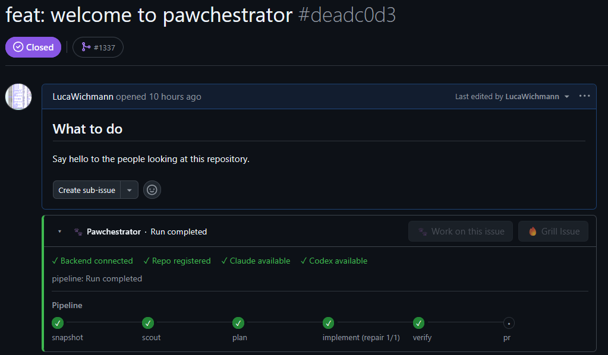

<p align="center">
  
</p>

<h1 align="center">Pawchestrator</h1>

<p align="center"><strong>GitHub issue in. Local agents run. Code comes out.</strong></p>

<p align="center">
  <a href="https://github.com/LucaWichmann/Pawchestrator/stargazers"></a>
  <a href="https://github.com/LucaWichmann/Pawchestrator/commits/main"></a>
  <a href="LICENSE"></a>
</p>

<p align="center">
  <a href="#install">Install</a> ·
  <a href="#quick-start">Quick start</a> ·
  <a href="#configuration">Configuration</a> ·
  <a href="docs/cli.md">CLI reference</a> ·
  <a href="docs/troubleshooting.md">Troubleshooting</a>
</p>

---

<p align="center">
  
</p>

---

`Issue → Snapshot → Scout → Plan → Implement → Verify → PR`

- Runs **Claude** and **Codex** in a structured pipeline - each stage hands off artifacts, not chat transcripts
- Triggered from a **GitHub issue page** via a browser userscript, or directly from the CLI
- Creates an **isolated git worktree** per issue and opens a draft PR when done
- Everything stays **local** - state, logs, worktrees, and tokens never leave your machine

---

## Install

### macOS / Linux

```sh
curl -fsSL https://raw.githubusercontent.com/LucaWichmann/Pawchestrator/main/install.sh | sh
```

### Windows (PowerShell)

```powershell
irm https://raw.githubusercontent.com/LucaWichmann/Pawchestrator/main/install.ps1 | iex
```

Both scripts clone the repo to `~/.pawchestrator-cli`, run `uv sync`, and run `pawchestrator doctor` to show what's ready.

> **Prerequisites:** [`uv`](https://docs.astral.sh/uv/getting-started/installation/), [`git`](https://git-scm.com/), [`gh`](https://cli.github.com/), [`claude`](https://github.com/anthropics/claude-code), [`codex`](https://github.com/openai/codex)

### Manual (dev / contributor)

```sh
git clone https://github.com/LucaWichmann/Pawchestrator.git
cd Pawchestrator
uv sync
uv run pawchestrator doctor
```

---

## Quick start

**1. Start the backend**

```powershell
uv run pawchestrator serve
```

**2. Install the browser extension**

Install [Tampermonkey](https://www.tampermonkey.net/) ([Chrome](https://chrome.google.com/webstore/detail/tampermonkey/dhdgffkkebhmkfjojejmpbldmpobfkfo) · [Firefox](https://addons.mozilla.org/firefox/addon/tampermonkey/)), then install the userscript:

<p>
  <a href="https://raw.githubusercontent.com/LucaWichmann/Pawchestrator/main/Pawchestrator.user.js"></a>
</p>

**3. Register your repo**

```powershell
uv run pawchestrator repo add C:\src\MY-REPO
```

**4. Run an issue**

Open a GitHub issue and click **Work on this issue** - Pawchestrator pairs on first use and runs the full pipeline.

Or run directly from the CLI:

```powershell
uv run pawchestrator issue start https://github.com/OWNER/REPO/issues/123
```

Full pairing and polling details: [docs/userscript.md](docs/userscript.md)

---

## Configuration

Config lives at `~/.pawchestrator/config.toml`. Minimal example:

```toml
[runners.claude]
model = "sonnet"
effort = "low"

[runners.codex]
model = "gpt-5.5"
reasoning_effort = "low"

[pipeline]
verify_repair_attempts = 1
```

Full reference - runners, per-stage overrides, epic workflow, CodeGraph, verify commands: [docs/configuration.md](docs/configuration.md)

---

## How it works

Pawchestrator breaks the issue-to-PR flow into discrete stages. Each stage reads an artifact from the previous one and writes its own - no long chat history passed between agents, no context bleed.

**Snapshot** fetches the GitHub issue body, metadata, and any sub-issues into a structured JSON artifact. **Scout** reads the snapshot and explores the codebase to build a file map and surface relevant context. **Plan** turns the scout report into an implementation plan - a concrete list of files and changes. **Implement** executes the plan in an isolated git worktree, writing actual code. **Verify** runs the repo's configured build, test, and lint commands against the worktree and produces a pass/fail report. **PR** pushes the worktree branch and opens a draft pull request with a structured run comment.

If the issue has GitHub sub-issues, Pawchestrator runs the epic workflow: sub-issues are processed in sequence on a shared branch, and a single draft PR is opened when all sub-issues complete.

Every stage writes its output to `~/.pawchestrator/runs/{run_id}/` so you can inspect, replay, or resume any point in the pipeline.

---

## Design

**Local-first.** The orchestration layer runs on your machine. State, logs, worktrees, and pairing tokens never leave your local environment. GitHub only sees a structured run comment, stage labels, and a draft PR - nothing is LLM-generated on GitHub's side.

**Structured handoffs.** Each stage exchanges JSON artifacts rather than prose summaries or accumulated chat history. This keeps individual agent context windows small, makes failures easy to diagnose, and lets you re-run any stage in isolation without replaying the whole pipeline.

**Two runners, right tool for each job.** Claude handles read-heavy reasoning stages (scout, plan, grill). Codex handles write-heavy implementation. Each runner gets only the permissions it needs for its stage - scout runs read-only, implement runs with write access to the worktree. If Claude hits a usage limit mid-pipeline, Pawchestrator falls back to Codex automatically and flags it in the run comment.

**Repo-local verification.** Build, test, and lint commands live in `.pawchestrator/verify.toml` committed to each repo. Verify runs those commands against the worktree before a PR is opened - not a post-hoc check, but a gate.

---

## Star History

<a href="https://www.star-history.com/?repos=LucaWichmann%2FPawchestrator&type=date&legend=top-left">
 <picture>
   <source media="(prefers-color-scheme: dark)" srcset="https://api.star-history.com/chart?repos=LucaWichmann/Pawchestrator&type=date&theme=dark&legend=top-left" />
   <source media="(prefers-color-scheme: light)" srcset="https://api.star-history.com/chart?repos=LucaWichmann/Pawchestrator&type=date&legend=top-left" />
   
 </picture>
</a>
