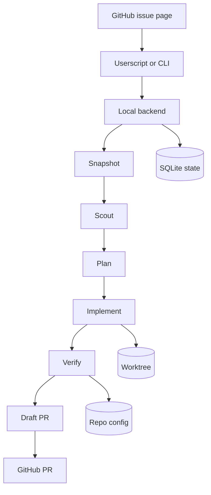

<p align="center">
  
</p>

<h1 align="center">Pawchestrator</h1>

<p align="center"><strong>GitHub issue in. Local agents run. Code comes out.</strong></p>

<p align="center">
  <a href="https://github.com/LucaWichmann/Pawchestrator/stargazers"></a>
  <a href="https://github.com/LucaWichmann/Pawchestrator/commits/main"></a>
  <a href="LICENSE"></a>
</p>

<p align="center">
  <a href="#install">Install</a> |
  <a href="#quick-start">Quick start</a> |
  <a href="#what-it-does">What it does</a> |
  <a href="#how-it-works">How it works</a> |
  <a href="#userscript-pairing">Userscript pairing</a> |
  <a href="#configuration">Configuration</a> |
  <a href="#troubleshooting">Troubleshooting</a>
</p>

---

## Install

Install Tampermonkey first:
[Chrome](https://chrome.google.com/webstore/detail/tampermonkey/dhdgffkkebhmkfjojejmpbldmpobfkfo) |
[Firefox](https://addons.mozilla.org/firefox/addon/tampermonkey/)

Then install the Pawchestrator userscript:

<p>
  <a href="https://raw.githubusercontent.com/LucaWichmann/Pawchestrator/main/Pawchestrator.user.js"></a>
</p>

## At a glance

| | |
|---|---|
| **What it is** | A local backend that coordinates GitHub issue snapshots, agent stages, verification, and draft PR creation. |
| **What it uses** | Claude Code and Codex runners, `gh`, local git worktrees, SQLite, and a browser userscript for issue-page control. |
| **What stays local** | State, logs, worktrees, pairing tokens, and run artifacts. |
| **What GitHub sees** | A structured run comment, stage labels, and a draft pull request. |

## How it works



## What it does

| Surface | Purpose | Notes |
|---|---|---|
| `pawchestrator serve` | Start the local FastAPI backend | Binds to `127.0.0.1:38472` and exposes `/health`, `/pair`, `/issue/start`, and `/runs/{run_id}`. |
| `pawchestrator doctor` | Check the local environment | Reports required and optional dependencies, plus local port, SQLite, and repo registry checks. |
| `pawchestrator issue snapshot <issue-url>` | Capture a GitHub issue snapshot | Writes a structured issue artifact for later stages. |
| `pawchestrator issue start <issue-url> [--repo-path ...]` | Run the full issue-to-PR pipeline | Executes snapshot -> scout -> plan -> implement -> verify -> pr. |
| `pawchestrator run scout <run-id>` | Re-run scouting for an existing run | Useful when you want to inspect or recover a specific stage. |
| `pawchestrator run plan <run-id>` | Re-run planning for an existing run | Reads the scout artifact and writes the implementation plan. |
| `pawchestrator run implement <run-id>` | Re-run implementation for an existing run | Uses the run worktree and writes file edits plus a report. |
| `pawchestrator run verify <run-id>` | Re-run verification for an existing run | Reads repo-local build/test commands and writes a verification report. |
| `pawchestrator run pr <run-id>` | Create the draft PR for a verified run | Pushes the worktree branch and opens or reuses the draft PR. |
| `pawchestrator repo add <path>` | Register a local clone | Required for browser-triggered runs that do not pass `--repo-path`. |
| `pawchestrator repo list` | List registered repos | Shows the `owner/repo -> local path` mapping. |
| `pawchestrator codegraph sync <run-id>` | Sync a merged CodeGraph index | Copies a run worktree index back only after its branch is already in `main`. |
| `pawchestrator sessions clear` | Revoke pairing sessions | Deletes stored browser pairing tokens. |

## Why this design

- Local-first keeps the orchestration inspectable, fast, and under your control.
- Structured artifacts beat long chat transcripts, so each stage hands off JSON or files instead of prose.
- GitHub comments are template-only and factual, not LLM-generated.
- Token spend stays low because the pipeline uses terse prompts, compact stage outputs, and local comments/state instead of verbose summaries.

## Quick start

### 1. Install dependencies

```powershell
uv sync
```

### 2. Check your setup

```powershell
uv run pawchestrator doctor
```

### 3. Start the backend

```powershell
uv run pawchestrator serve
```

The backend binds to `127.0.0.1:38472`.

### 4. Run an issue from the CLI

```powershell
uv run pawchestrator issue start https://github.com/OWNER/REPO/issues/123 --repo-path C:\src\REPO
```

If you already registered the repository with `pawchestrator repo add <path>`, you can omit `--repo-path` from browser-triggered runs and let Pawchestrator resolve the clone from the `owner/repo` mapping.

## Userscript pairing

The browser flow uses `Pawchestrator.user.js` to add controls to GitHub issue pages and call the local backend.

1. Start the backend with `uv run pawchestrator serve`.
2. Register the local repository clone:

   ```powershell
   uv run pawchestrator repo add C:\src\REPO
   ```

3. Install [`Pawchestrator.user.js`](Pawchestrator.user.js) in Tampermonkey.
4. Open a GitHub issue page and click the `Work on this issue` button in the issue header.
5. On first use, the userscript calls `POST /pair`.
6. The backend prompts in the terminal; press Enter to approve or Ctrl+C to deny.
7. Pawchestrator stores the token in Tampermonkey and sends it on later requests as `X-Pawchestrator-Token`.
8. The userscript then calls `POST /issue/start` and polls `GET /runs/{run_id}` for progress updates.

`/health` stays open for offline checks. All other authenticated browser calls require the pairing token.

## Configuration

Pawchestrator loads optional defaults from `~/.pawchestrator/config.toml`.

### Runner defaults

```toml
[app]
debug = true

[runners.claude]
execution = "native"
model = "sonnet"
effort = "low"
allowed_tools = ["Read", "Glob", "Grep"]
bypass_permissions = false

[runners.codex]
execution = "auto"
model = "gpt-5.5"
reasoning_effort = "low"
sandbox = "workspace-write"
approval_policy = "never"
bypass_sandbox = false
previous_response_not_found_attempts = 3

[codegraph]
enabled = true
directory = ".codegraph"
sync_policy = "safe-lazy"
```

Notes:

- `doctor` reads the same config and checks the local runner/tooling setup.
- `debug = true` prints runner argv plus captured stdout/stderr.
- Per-stage overrides live under `[stages.<stage>.claude]` and `[stages.<stage>.codex]`.
- `execution = "auto"` on Codex tries native first and may fall back to WSL on known Windows sandbox failures.
- `previous_response_not_found_attempts` caps Codex recovery attempts, including the original attempt.
- Pawchestrator tries to preserve local CodeGraph databases even when `.codegraph/` is ignored by git. Before implementation it seeds the issue worktree from the source repo index with a SQLite-safe copy; it syncs back only when git proves the run branch has already merged into `main`.

### Local state

| Path | Contents |
|---|---|
| `~/.pawchestrator/config.toml` | Optional app and runner defaults. |
| `~/.pawchestrator/database.sqlite` | Workflow runs, stages, repo registrations, and artifact metadata. |
| `~/.pawchestrator/sessions.json` | Browser pairing tokens. |
| `~/.pawchestrator/runs/{run_id}/` | Issue snapshot, scout report, plan, implementation report, verification report, PR draft, and logs. |
| `~/.pawchestrator/worktrees/{owner}/{repo}/issue-{number}/` | Isolated git worktree for each issue run. |
| `<repo>/.pawchestrator/verify.toml` | Tracked repo verification commands. |

### CodeGraph indexes

CodeGraph indexes are usually local machine artifacts and are often ignored by git because the SQLite database can be large. Pawchestrator still tries to support them for agent runs:

- If the source repo has `.codegraph/codegraph.db`, Pawchestrator copies it into the issue worktree before invoking the implementation agent.
- The copy uses SQLite backup semantics and does not copy `codegraph.db-wal` or `codegraph.db-shm`.
- Worktree index changes stay isolated while the branch is unmerged.
- Sync-back to the source repo only happens when the branch HEAD is already contained in `main`, either opportunistically on later runs or via `uv run pawchestrator codegraph sync <run-id>`.

### Repo verification config

Verification reads repo-local commands from `.pawchestrator/verify.toml` in the run worktree. Commit this file with the repository so every contributor and every Pawchestrator worktree uses the same verification steps.

```toml
[commands]
build = "cmake --build build"
test = "ctest --test-dir build"
lint = "ruff check ."
```

Pawchestrator runs commands in `build`, `test`, `lint` order and stops on the first failure. If the repo config is missing, or no build/test commands are configured, verify skips with a warning instead of failing the whole run.

## Troubleshooting

### GitHub issue runs cannot find the repo

Browser-triggered runs rely on `owner/repo -> local path` registration. If Pawchestrator says the repo is not registered, run:

```powershell
uv run pawchestrator repo add C:\src\REPO
```

### Pairing does not work

- Make sure the backend is running on `127.0.0.1`.
- Approve the pairing prompt in the terminal after the first `POST /pair`.
- If you want to reset the browser token, run `uv run pawchestrator sessions clear`.

### Windows Codex sandbox issues

If native Codex on Windows fails with sandbox setup errors, `os error 740`, or a run that produces no diff:

1. Run Codex once interactively in the repo so the Windows sandbox setup can finish.
2. Set `[windows] sandbox = "unelevated"` in `~/.codex/config.toml` if elevated setup is blocked on your machine.
3. Install Codex inside WSL and set `[runners.codex] execution = "wsl"` for Pawchestrator.

```powershell
wsl --exec sh -lc "npm install -g @openai/codex@latest && codex --version"
```

Use `bypass_sandbox = true` only as an intentional last resort for trusted repos.

### Codex `previous_response_not_found`

Codex can sometimes fail with `previous_response_not_found`, especially through wrappers such as `codex-lb`. This is usually transient: rerunning the same prompt, or resuming the latest Codex exec session and sending the same prompt again, often succeeds.

Pawchestrator handles this inside `CodexRunner`. When Codex exits nonzero and reports both `previous_response_not_found` and `previous_response_id`, Pawchestrator retries with:

```powershell
codex exec resume --last -
```

The original prompt is sent again through stdin. The default cap is 3 total attempts, including the first failing attempt. Configure it with:

```toml
[runners.codex]
previous_response_not_found_attempts = 3
```

This retry is local to the Codex runner. Pawchestrator does not restart the whole workflow or paste the full workflow context into Codex again. Retry and exhaustion notes are appended to the runner log.

